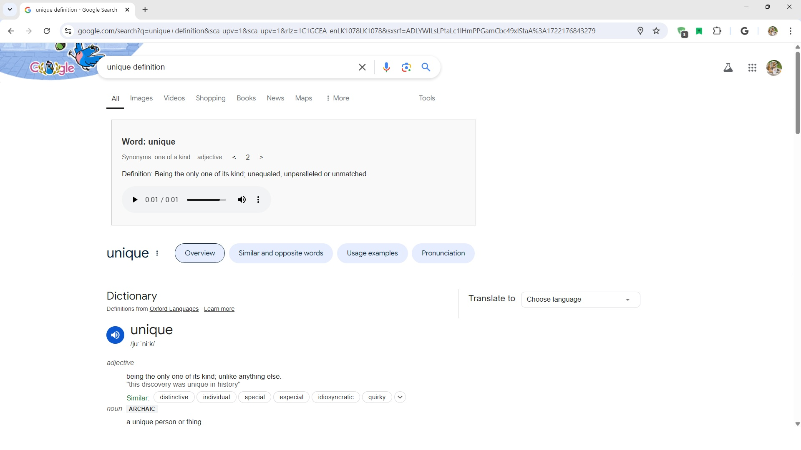
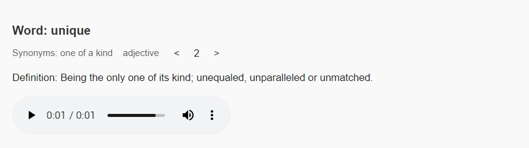

# Chrome Dictionary Extension

Welcome to the Chrome Dictionary Extension! This extension uses the Free Dictionary API to provide definitions and word information directly in your browser.

## Features

- **Instant Definitions:** Get word definitions quickly without leaving your current tab.
- **Simple Installation:** Easy setup process for users to start using the extension right away.
- **User-Friendly Interface:** Clean and intuitive design for a seamless experience.

## Installation

Follow these steps to install the Chrome Dictionary Extension:

1. **Download the Extension:**
   - Go to the [Releases](https://github.com/udan-jayanith/Dictionary/releases/tag/v1.0.0) page.
   - Download the latest `.rar` file.

2. **Extract the Files:**
   - Extract the downloaded `.rar` file to a permanent location on your computer.

3. **Install the Extension:**
   - Open Chrome and go to [chrome://extensions/](chrome://extensions/) .
   - Enable "Developer mode" by toggling the switch in the top right corner.
   - Click on "Load unpacked" and select the folder where you extracted the files.
   - Disable Collect errors by going to extension Details page.
   - The extension should now be installed and ready to use.

## Usage
1. **Search for a Word:**
   
   - Enter the word you want to look up in the search bar.
   - Press `Enter` or click the search icon to see the definition and other information.

## Contributing

We welcome contributions! If you have suggestions, feature requests, or bug reports, please open an issue or submit a pull request.

## Contact

For any questions or support, please open an issue on GitHub or contact me at [j.udanjayanith@gmail.com](mailto:j.udanjayanith@gmail.com).
